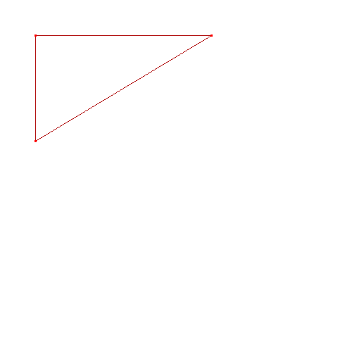

# Тренажёр для работы с G-Code
## Условия
- Работа происходит в абсолютных координатах
- Единиц измерения мм
- Отрисовка только в плоскости XY
- Сверление (отрисовка) происходит только при Z < 0
- Результат отрисовывется в файле в формате `.bmp`
- Максимальная координата X500 Y500

## Программные требования
Необходимо чтобы на ПК был установлен комплятор `gcc` или `clang`

## Компиляция
в корневой директории нужно выполнить команду
```
g++ ./src/main.cpp -o ./main -std=c++17
```
или
```
clang++ ./src/main.cpp -o ./main -std=c++17
```

## Запуск примера
```
./main < ./examples/ex.cnc
```
Результат команды будет в файле `result.bmp`, в тот папке, в которой запускается утилита.

## Пример файла G-Code
```
G21 ;
G90 ;
G00 Z5 ;
G00 X50 Y50 ;
M03 S1500 ;

; Треугольник
G01 Z-2 F100
G01 X300 Y50
G01 X50 Y200
G01 X50 Y50

; Завершение
G00 Z5
M05
M30

```

## Пример логов
```
[INFO] Set new position: X0 Y0 Z5
[INFO] Set new position: X50 Y50 Z5
[INFO] Spindle ON, speed: S1500
[INFO] Moving tool to position: X50 Y50 Z-2
[INFO] Moving tool to position: X300 Y50 Z-2
[INFO] Moving tool to position: X50 Y200 Z-2
[INFO] Set new position: X50 Y200 Z5
[INFO] Spindle OFF
[INFO] End of the programm
```

## Пример изображения
